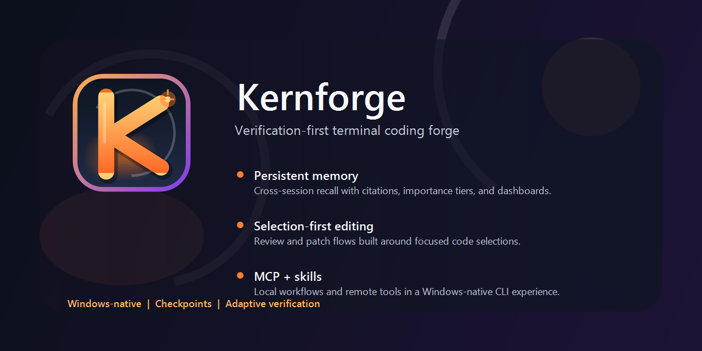
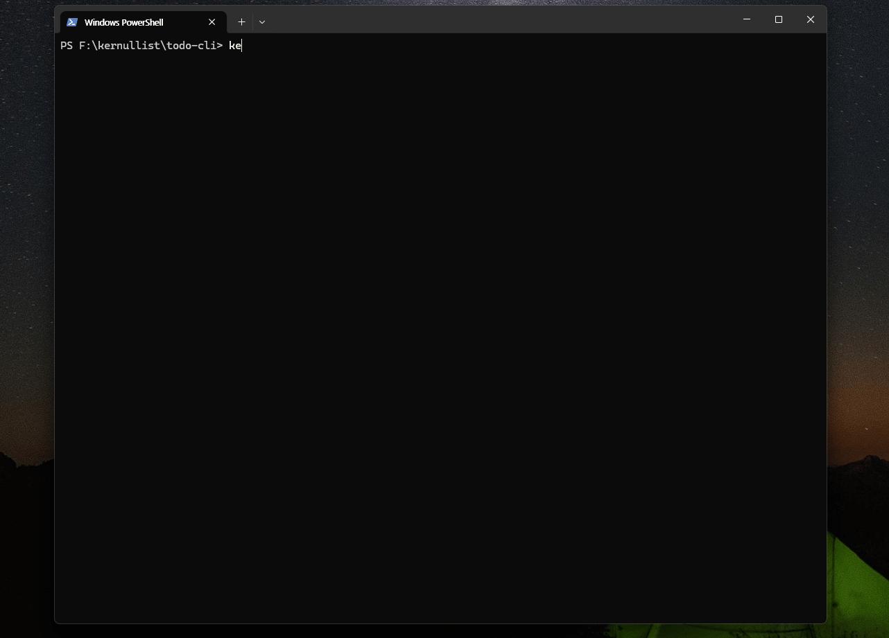

# Kernforge




`Kernforge`는 Go로 만든 터미널 중심 AI 코딩 CLI입니다. 로컬 우선 개발 흐름에 맞춰 설계되어 있고, 특히 Windows security, anti-cheat, telemetry, driver 워크플로우와 대형 프로젝트 분석에 실용적으로 쓰기 좋게 구현되어 있습니다.

현재 Kernforge의 가장 큰 강점은 `multi-agent project analysis pipeline`입니다. 큰 워크스페이스를 재사용 가능한 knowledge pack으로 정리하고, 그 분석 결과를 편집, 검증, evidence, policy 단계까지 그대로 이어갈 수 있습니다.  
특히 `project analysis -> performance lens -> adaptive verification -> evidence store -> persistent memory -> hook policy -> checkpoint/rollback` 흐름을 중심으로, driver, telemetry, memory-scan, Unreal 보안 작업을 더 안전하고 일관되게 진행할 수 있도록 설계되어 있습니다.

## 대표 강점

Kernforge에서 가장 먼저 봐야 할 기능 하나를 꼽으면 `multi-agent project analysis`입니다.

- `/analyze-project [--mode map|trace|impact|security|performance] <goal>`는 일회성 요약이 아니라 재사용 가능한 architecture map을 만든다.
- 결과물은 knowledge pack, performance lens, structural index, vector-ready analysis set으로 남는다.
- 이 분석 자산은 이후 review, edit, verification, policy 흐름까지 계속 재사용된다.

## 문서

빠른 시작:
- [한국어 빠른 시작](./QUICKSTART_kor.md)
- [English Quickstart](./QUICKSTART.md)

가이드:
- [한국어 기능 활용 가이드](./FEATURE_USAGE_GUIDE_kor.md)
- [English Feature Usage Guide](./FEATURE_USAGE_GUIDE.md)

플레이북:
- [Driver 플레이북](./PLAYBOOK_driver_kor.md)
- [Telemetry 플레이북](./PLAYBOOK_telemetry_kor.md)
- [Memory-Scan 플레이북](./PLAYBOOK_memory_scan_kor.md)

설계 문서:
- [한국어 로드맵](./ROADMAP_kor.md)
- [한국어 Hook Engine 스펙](./HOOK_ENGINE_SPEC_kor.md)
- [한국어 Live Investigation Mode 스펙](./LIVE_INVESTIGATION_SPEC_kor.md)
- [한국어 Adversarial Simulation 스펙](./ADVERSARIAL_SIMULATION_SPEC_kor.md)
- [한국어 차세대 Project Analysis 스펙](./PROJECT_ANALYSIS_NEXT_SPEC_kor.md)

가장 추천되는 실사용 흐름은 [한국어 상세 사용 가이드](./FEATURE_USAGE_GUIDE_kor.md)에 정리되어 있습니다. 특히 `investigate -> simulate -> review/edit/plan -> verify -> evidence/memory/hooks` 루프를 그대로 따라가 보면 현재 Kernforge의 핵심 가치를 가장 빨리 체감할 수 있습니다.

## 왜 Kernforge인가

Kernforge는 큰 보안 민감 코드베이스를 먼저 정확히 이해한 다음 변경해야 하는 상황에서 특히 강합니다.

1. driver/signing/symbol/package readiness처럼 실수 비용이 큰 작업
2. telemetry/provider/manifest drift처럼 테스트만으로 놓치기 쉬운 작업
3. memory-scan, Unreal integrity처럼 구조 이해와 운영 가드레일이 동시에 필요한 작업

핵심 차별점은 다음과 같습니다.

1. conductor와 여러 worker/reviewer 패스를 사용해 큰 워크스페이스를 분석할 수 있습니다.
2. 일회성 요약이 아니라 재사용 가능한 knowledge pack과 performance lens를 만듭니다.
3. 그 분석 결과를 review, edit, verification, investigation 흐름으로 그대로 이어갑니다.
4. verification 결과를 evidence와 persistent memory에 구조적으로 남깁니다.
5. 이후 hook policy, push/PR 판단, safety checkpoint까지 연결합니다.

## 현재 구현된 기능

- 재사용 가능한 knowledge pack과 performance lens를 만드는 multi-agent project analysis
- 대화형 REPL과 `-prompt` 기반 one-shot 실행
- `ollama`, `anthropic`, `openai`, `openrouter`, `openai-compatible` provider 지원
- 파일, 패치, 셸, git 중심 도구 호출
- `git_add`, `git_commit`, `git_push`, `git_create_pr` 같은 전용 git 도구
- 로컬 파일 멘션, 이미지 멘션, MCP 리소스 멘션
- 세션 저장, 재개, 이름 변경, clear, compact, Markdown export
- 프로젝트 메모리 파일과 세션 간 persistent memory
- evidence store, evidence search, evidence dashboard
- 로컬 `SKILL.md` 스킬 탐색과 요청 단위 활성화
- stdio 기반 MCP server의 tool, resource, prompt 연결
- Windows용 별도 텍스트 viewer와 WebView2 기반 diff review/diff viewer
- adaptive verification, 검증 이력 대시보드, checkpoint, rollback
- hook engine, workspace hook rules, evidence-aware push/PR policy
- 별도 reviewer 모델을 사용하는 plan-review 워크플로우
- `.kernforge/features` 아래에 spec/plan/tasks/implementation artifact를 남기는 tracked feature 워크플로우

## 핵심 특징

### Project Analysis

- `/analyze-project [--mode map|trace|impact|security|performance] <goal>`로 conductor와 여러 sub-agent를 사용해 프로젝트 문서를 생성
- `--mode`를 생략하면 기본 모드는 `map`
- `security` 모드에서는 관련 경로가 있을 때 `driver`, `IOCTL`, `handle`, `memory`, `RPC` surface로 결과를 분해해서 본다.
- 변경되지 않은 shard는 가능한 경우 재사용하는 incremental 분석
- goal에 특정 디렉토리 힌트가 있으면 해당 하위 영역으로 분석 범위를 좁힐 수 있다.
- interactive 실행에서는 hidden directory나 external-looking directory를 보여 주고 이번 분석에서 제외할지 확인할 수 있다.
- semantic fingerprint 기반 invalidation으로 file hash만으로 놓치기 쉬운 구조 변화까지 다시 분석
- `.uproject`, `.uplugin`, `.Build.cs`, `.Target.cs`, `compile_commands.json`를 build alignment에 반영해 재사용 가능한 build context를 만든다.
- `structural_index_v2`는 이제 file 중심 요약을 넘어 symbol anchor, build ownership edge, function-level call edge, overlay edge를 함께 담는다.
- `trace`, `impact`, `security` retrieval은 graph neighborhood를 확장하고 `build_context_v2`, `path_v2` 근거를 함께 남긴다.
- Unreal project/module/target/type/network/asset/system/config 신호를 구조화해 대형 UE 프로젝트 대응
- semantic shard planner와 semantic-aware worker/reviewer prompt로 startup, network, UI, GAS, asset/config, integrity 영역을 우선 분석
- knowledge pack 외에도 structural index, `structural_index_v2`, Unreal semantic graph, vector corpus, vector ingestion export를 함께 생성
- source anchor parser는 template out-of-line method, operator, `requires`, `decltype(auto)`, API macro가 낀 scope, friend function 같은 modern C++ 패턴까지 추적한다.
- `security` 모드 최종 문서에는 privileged path를 따로 읽기 쉽도록 `Security Surface Decomposition` 섹션이 추가된다.
- 메인 채팅 모델과 별도로 worker/reviewer 모델을 지정 가능
- `.kernforge/analysis` 아래에 architecture knowledge pack과 performance lens 출력
- `/analyze-performance [focus]`로 최신 분석 산출물을 기준으로 병목과 hot path 분석

### 보안 검증과 정책 루프

- driver, telemetry, Unreal, memory-scan 중심 security-aware verification
- verification history와 verification dashboard
- verification 결과의 evidence store 누적
- evidence 검색과 evidence dashboard
- `/set-auto-verify [on|off]` 기반 automatic verification 런타임 토글
- `/detect-verification-tools`, `/set-*-path` 기반 Windows verification tool 경로 탐지와 override
- recent failed evidence를 이용한 hook 기반 push/PR 경고, 확인, 차단
- 반복 실패 상황에서 자동 safety checkpoint 생성 가능

### 편집 워크플로우

- 파일 쓰기 전 WebView2 diff review
- selection-aware edit preview
- 편집 후 자동 verification
- 큰 파일 편집 루프에서 `read_file`는 변경되지 않은 동일 범위, 포함되는 하위 범위, 부분 겹침 범위를 재사용해서 불필요한 재읽기를 줄인다.
- 최근 `read_file` 문맥과 겹치거나 가까운 `grep` 결과에는 `[cached-nearby:inside]`, `[cached-nearby:N]` 힌트가 붙어 다음 읽기 범위를 더 좁게 잡도록 돕는다.
- 같은 파일에 대한 반복 `read_file` 턴은 캐시 기반 경고를 먼저 주고, 그래도 진전이 없을 때만 강한 반복 호출 중단으로 넘어간다.
- `Allow write?`에서 `a`를 누르면 현재 세션 동안만 write auto-approval이 켜진다.
- `Open diff preview?`에서 `a`를 누르면 현재 수정과 이후 diff preview를 세션 동안 자동 승인
- `git_add`, `git_commit`, `git_push`, `git_create_pr` 같은 git 변경 도구는 별도의 `Allow git?` 세션 승인 경로를 사용한다.
- git 변경 도구는 일반 review/edit 턴이 아니라, 사용자가 명시적으로 git 작업을 요청한 경우에만 쓰는 것이 기본 동작이다.
- 한 요청의 첫 편집 전에 자동 checkpoint 생성
- 수동 checkpoint, checkpoint diff, rollback
- `/open` 중심 selection-first 리뷰/수정 흐름

### Tracked Feature Workflow

- `/new-feature <task>`는 tracked feature workspace를 만들고 `spec.md`, `plan.md`, `tasks.md`를 생성한다.
- feature artifact는 `.kernforge/features/<id>` 아래에 저장되어 여러 세션에 걸친 작업을 이어가기 쉽다.
- `/new-feature status|plan|implement|close [id]`로 active feature 상태 확인, 재계획, 실행, 종료를 분리해서 다룰 수 있다.
- `/do-plan-review <task>`는 여전히 one-shot 계획 검토 후 즉시 실행하는 흐름에 더 적합하다.

### 입력과 프롬프트

- 대화형 채팅 REPL
- `-prompt` 기반 단발 실행
- `-image`, `-i`, `@path/to/image.png` 이미지 첨부
- `@main.go` 같은 파일 멘션
- `@main.go:120-150` 같은 라인 범위 멘션
- `@mcp:docs:getting-started` 같은 MCP 리소스 멘션
- 줄 끝에 `\`를 붙여 멀티라인 입력
- 파일을 명시하지 않았을 때 자동 코드 scouting
- 최근 `analyze-project` 결과를 cached architecture context로 재사용해서 큰 코드 영역 재탐색을 줄일 수 있다.
- cached analysis만으로 답이 충분하면 추가 tool 호출 없이 바로 응답할 수 있다.
- `read_file`가 cached NOTE를 반환하면 Kernforge는 해당 줄을 이미 본 문맥으로 간주해 같은 큰 범위를 다시 읽는 흐름을 줄인다.
- `grep`의 `cached-nearby` 힌트는 아직 읽지 않은 인접 줄만 좁게 다시 읽도록 유도해서 큰 파일 재탐색 비용을 낮춘다.
- 분석, 설명, 진단, 문서화 요청은 기본적으로 read-only investigation 모드로 처리된다.
- 명시적으로 수정까지 요청한 프롬프트는 tool-driven edit 흐름을 유지하고, Kernforge는 모델이 패치를 사용자에게 되돌리려 하면 한 번 더 수정 도구 사용을 유도한다.

### 사용성

- 명령, 경로, 멘션, MCP 대상, 고정 인자, `/provider status|anthropic|openai|openrouter|ollama` 같은 provider 하위 명령, analyze-project mode, `/resume`, `/mem-show`, `/evidence-show`, `/investigate show`, `/simulate show`, `/new-feature status|plan|implement|close` 같은 저장된 id까지 `Tab` 완성
- command/subcommand 자동완성 메뉴에 각 후보 설명을 같이 보여줘서 이름만 나열되지 않게 했다.
- 현재 입력 취소를 위한 `Esc`
- 진행 중 요청 취소를 위한 `Esc`
- 메인 프롬프트에서 빈 입력 상태로 `Enter`를 눌러도 빈 턴을 만들지 않고 무시한다.
- REPL은 compact branded banner, subtle turn divider, grouped status/config section, assistant/tool activity stream 분리로 더 촘촘한 터미널 UX를 사용한다.
- assistant streaming 출력은 선행 blank chunk를 무시하고, progress/info 출력 전 경계를 정리하며, 반복 follow-on preamble 사이에 줄바꿈을 넣어 더 읽기 쉽게 출력된다.
- 기본 대기 문구는 thinking prefix와 중복되지 않게 정리해서 같은 의미를 두 번 보여주지 않는다.
- 반복 blank streamed chunk는 빈 줄 대신 compact working 상태로 바꿔 보여준다.
- 문장 중간에서 잘린 최종 답변은 한 번 continuation 재시도를 걸고 합쳐서 출력한 뒤 프롬프트로 복귀한다.
- Windows 콘솔에서 짧게 누른 `Esc`도 안정적으로 요청 취소
- 요청 취소 직후 다음 프롬프트가 연속 `Esc` 입력으로 자동 취소되지 않도록 안정화
- Windows 콘솔의 `Up`, `Down` 입력 히스토리
- prompt 조립 시 긴 summary를 잘라 넣고, skill/MCP catalog는 실제로 필요한 요청에서만 크게 싣는다.
- auto-scout는 위치 찾기, 정의 찾기, 참조 찾기 성격의 질문에 더 집중하고 턴당 문맥 투입량도 줄였다.

### 지속성

- `/resume` 기반 세션 재개
- 세션 이름 변경과 대화 Markdown export
- citation id, trust, importance가 붙는 persistent memory
- verification category, tag, artifact, failure 기반 memory 검색
- `KERNFORGE.md`, `.kernforge/KERNFORGE.md` 기반 프로젝트 가이드 로딩
- 시스템 locale 기반 자동 언어 지시

### 확장성

- 로컬 `SKILL.md` 스킬
- MCP tool
- MCP resource
- MCP prompt

## 빠른 시작

### 빌드

```powershell
go build -o kernforge.exe .
```

### WebView2 Runtime

Windows diff review와 read-only diff viewer는 WebView2를 사용합니다.

권장 배포 방식:

1. `Evergreen Bootstrapper`
   일반적인 온라인 설치에 가장 무난합니다.
2. `Evergreen Standalone Installer`
   오프라인 또는 제한된 환경에 더 적합합니다.
3. `Fixed Version Runtime`
   렌더링 엔진 버전을 반드시 고정해야 할 때만 권장합니다.

Kernforge 기준 실무 권장안:

1. 설치 프로그램에 `Evergreen Bootstrapper`를 포함하거나 다운로드 경로를 둡니다.
2. Kernforge 실행 전에 WebView2 Runtime 존재 여부를 확인합니다.
3. 없으면 먼저 설치합니다.
4. 그래도 WebView2 초기화가 실패하면 workflow에 따라 브라우저 기반 preview 또는 터미널 diff 출력으로 fallback합니다.

참고:

- [Microsoft WebView2 배포 가이드](https://learn.microsoft.com/en-us/microsoft-edge/webview2/concepts/distribution)
- [WebView2 Runtime 다운로드](https://developer.microsoft.com/en-us/microsoft-edge/webview2/)

### 실행

```powershell
.\kernforge.exe
```

아직 provider/model이 설정되지 않았다면 Kernforge는 다음 순서로 초기 설정을 도와줍니다.

1. 로컬 Ollama 서버를 탐지합니다.
2. 발견되면 바로 연결할지 묻습니다.
3. 아니면 provider 선택 과정을 진행합니다.
4. model, API key, base URL을 입력받습니다.
5. 다음 실행부터 재사용할 수 있도록 저장합니다.

### One-Shot 실행

```powershell
.\kernforge.exe -prompt "이 프로젝트 구조를 설명해줘"
```

이미지 1장 첨부:

```powershell
.\kernforge.exe -prompt "이 스크린샷의 오류 원인을 설명해줘" -image .\screenshot.png
```

이미지 여러 장 첨부:

```powershell
.\kernforge.exe -prompt "이 두 스크린샷 차이를 비교해줘" -image .\before.png,.\after.png
```

### Provider를 지정해서 실행

Anthropic:

```powershell
$env:ANTHROPIC_API_KEY = "your_key"
.\kernforge.exe -provider anthropic -model claude-sonnet-4
```

OpenAI:

```powershell
$env:OPENAI_API_KEY = "your_key"
.\kernforge.exe -provider openai -model gpt-4.1
```

OpenRouter:

```powershell
$env:OPENROUTER_API_KEY = "your_key"
.\kernforge.exe -provider openrouter -model openrouter/auto
```

Ollama:

```powershell
.\kernforge.exe -provider ollama -base-url http://localhost:11434 -model qwen3.5:14b
```

OpenAI-compatible:

```powershell
$env:OPENAI_API_KEY = "your_key"
.\kernforge.exe -provider openai-compatible -base-url http://localhost:8000/v1 -model my-model
```

대화형 REPL 안에서는 `/provider status`로 현재 provider, 정규화된 `base_url`, API key 설정 여부, provider별 budget visibility를 바로 확인할 수 있습니다.

LM Studio:

```powershell
.\kernforge.exe -provider openai-compatible -base-url http://localhost:1234/v1 -model local-model-id
```

### Windows Security Workflow 예시

Driver 변경을 안전하게 밀어붙이는 가장 기본 흐름:

1. driver 관련 파일을 수정합니다.
2. `/verify`를 실행해 signing, symbol, package, verifier readiness 중심 verification plan을 확인합니다.
3. `/evidence-dashboard` 또는 `/evidence-search category:driver`로 최근 failed evidence를 확인합니다.
4. 필요하면 `/mem-search category:driver`로 이전 세션 맥락까지 확인합니다.
5. push 또는 PR 생성 시 hook policy가 최근 evidence를 다시 보고 경고, 확인, 차단, checkpoint 생성을 수행합니다.

더 공격자 관점까지 포함한 권장 흐름:

1. `/investigate start driver-visibility guard.sys`
2. `/investigate snapshot`
3. `/simulate tamper-surface guard.sys`
4. `/open driver/guard.cpp`
5. `/review-selection integrity risk paths`
6. `/edit-selection harden the selected integrity checks`
7. `/verify`
8. `/evidence-dashboard category:driver`

여기서 `driver-visibility` preset은 드라이버 로드 root cause를 깊게 파고드는 분석기가 아니라, 현재 시점의 드라이버 가시성, verifier 상태, 관련 artifact 존재 여부를 빠르게 남기는 lightweight triage snapshot이다.

이 흐름 전체 설명은 [한국어 상세 사용 가이드](./FEATURE_USAGE_GUIDE_kor.md)에 있습니다.

Telemetry 회귀를 볼 때의 기본 흐름:

1. provider, manifest, XML 관련 파일을 수정합니다.
2. `/verify`를 실행합니다.
3. `/evidence-search category:telemetry outcome:failed`로 최근 provider/XML 실패 흔적을 봅니다.
4. `/mem-search category:telemetry tag:provider`로 과거 세션의 판단과 회귀 맥락을 다시 봅니다.
5. 이후 push/PR 전에 hook이 추가 review context나 확인을 요구할 수 있습니다.

### 자주 쓰는 명령 치트시트

검증:
- `/verify`
- `/verify-dashboard`

증거:
- `/evidence`
- `/evidence-search category:driver outcome:failed`
- `/evidence-dashboard`

메모리:
- `/mem-search category:telemetry tag:provider`
- `/mem-dashboard`

정책:
- `/hooks`
- `/hook-reload`

## 커맨드라인 옵션

| 옵션 | 설명 |
| --- | --- |
| `-cwd <dir>` | 시작 workspace root 지정 |
| `-provider <name>` | provider 선택 |
| `-model <name>` | model 선택 |
| `-base-url <url>` | provider base URL override |
| `-prompt "<text>"` | 단일 프롬프트 실행 후 종료 |
| `-image <paths>` / `-i` | one-shot 모드에서 이미지 첨부, 쉼표 구분 |
| `-resume <session-id>` | 저장된 세션 재개 |
| `-permission-mode <mode>` | 권한 모드 지정 |
| `-y` | 모든 권한 자동 승인 (`bypassPermissions`) |

참고:

- `-image`는 `-prompt`와 함께 사용해야 합니다.
- `-preview-file`, `-preview-result-file`, `-viewer-file`, `-viewer-result-file`는 내부 창 처리용 옵션입니다.

## 워크스페이스와 설정

### Workspace Root와 Current Directory

Kernforge는 두 가지 위치 개념을 따로 관리합니다.

- workspace root
- REPL 내부 current working directory

workspace root는 시작 시 `-cwd` 또는 현재 프로세스 디렉터리로 정해지며, 파일 도구는 이 범위를 벗어나지 않습니다.

REPL 안에서 `!cd`를 사용하면 current directory만 바뀌고 workspace 경계는 유지됩니다.
상대 경로 기반의 읽기/탐색 도구는 먼저 current directory를 기준으로 찾고, 거기서 찾지 못하면 workspace root를 기준으로 한 번 더 찾습니다.

### 설정 파일 위치

- 전역 설정: `~/.kernforge/config.json`
- 워크스페이스 설정: `.kernforge/config.json`

### 병합 순서

뒤에 오는 항목이 앞선 항목을 덮어씁니다.

1. 전역 설정
2. 워크스페이스 설정
3. 환경 변수
4. 커맨드라인 플래그

### 예시 설정

```json
{
  "provider": "ollama",
  "model": "qwen3.5:14b",
  "base_url": "http://localhost:11434",
  "permission_mode": "default",
  "shell": "powershell",
  "request_timeout_seconds": 1200,
  "max_tool_iterations": 16,
  "auto_compact_chars": 45000,
  "auto_checkpoint_edits": true,
  "auto_verify": true,
  "msbuild_path": "C:\\Program Files\\Microsoft Visual Studio\\2022\\Community\\MSBuild\\Current\\Bin\\MSBuild.exe",
  "cmake_path": "C:\\Program Files\\CMake\\bin\\cmake.exe",
  "auto_locale": true,
  "hooks_enabled": true,
  "hooks_fail_closed": false
}
```

### 주요 설정 필드

| 필드 | 설명 |
| --- | --- |
| `provider` | `ollama`, `anthropic`, `openai`, `openrouter`, `openai-compatible` |
| `model` | provider에 전달할 모델 이름 |
| `base_url` | provider API base URL |
| `api_key` | API key |
| `temperature` | 모델 temperature |
| `max_tokens` | completion 최대 토큰 수 |
| `request_timeout_seconds` | 모델 요청 timeout 초 단위 설정, timeout 시 한 번 자동 재시도 |
| `max_tool_iterations` | 요청당 tool loop 최대 반복 수 |
| `permission_mode` | `default`, `acceptEdits`, `plan`, `bypassPermissions` |
| `shell` | `run_shell`에 사용할 셸 |
| `session_dir` | 세션 JSON 저장 디렉터리 |
| `auto_compact_chars` | 자동 compact를 시도할 대략적 컨텍스트 길이 |
| `auto_checkpoint_edits` | 첫 편집 전에 안전 checkpoint 생성 |
| `auto_verify` | 편집 후 automatic verification의 마스터 스위치 |
| `msbuild_path` | PATH가 불완전할 때 사용할 workspace MSBuild override |
| `cmake_path` | PATH가 불완전할 때 사용할 workspace CMake override |
| `ctest_path` | PATH가 불완전할 때 사용할 workspace CTest override |
| `ninja_path` | PATH가 불완전할 때 사용할 workspace Ninja override |
| `auto_locale` | 시스템 locale을 프롬프트에 자동 주입 |
| `memory_files` | 추가 메모리 파일 경로 |
| `skill_paths` | 추가 skill 탐색 경로 |
| `enabled_skills` | 항상 프롬프트에 주입할 skill |
| `mcp_servers` | MCP 서버 정의 |
| `profiles` | 최근 또는 고정 provider/model profile |
| `hooks_enabled` | hook engine 활성화 여부 |
| `hook_presets` | 워크스페이스에 로드할 hook preset 목록 |
| `hooks_fail_closed` | hook 평가 실패 시 허용 대신 차단할지 여부 |
| `project_analysis` | multi-agent project analysis 설정, 출력 경로, worker/reviewer profile |
| `plan_review` | `/do-plan-review`용 reviewer 모델 설정 |
| `review_profiles` | reviewer profile 저장 목록 |

### 환경 변수

공통 override:

- `KERNFORGE_PROVIDER`
- `KERNFORGE_MODEL`
- `KERNFORGE_BASE_URL`
- `KERNFORGE_API_KEY`
- `KERNFORGE_PERMISSION_MODE`
- `KERNFORGE_SHELL`
- `KERNFORGE_SESSION_DIR`
- `KERNFORGE_REQUEST_TIMEOUT_SECONDS`
- `KERNFORGE_AUTO_CHECKPOINT_EDITS`
- `KERNFORGE_AUTO_VERIFY`
- `KERNFORGE_AUTO_LOCALE`
- `KERNFORGE_MSBUILD_PATH`
- `KERNFORGE_CMAKE_PATH`
- `KERNFORGE_CTEST_PATH`
- `KERNFORGE_NINJA_PATH`

provider별:

- `ANTHROPIC_API_KEY`
- `OPENAI_API_KEY`
- `OPENROUTER_API_KEY`
- `OLLAMA_HOST`
- `OLLAMA_API_KEY`

## Provider 지원

### Ollama

- 기본 base URL: `http://localhost:11434`
- `OLLAMA_HOST`, `OLLAMA_API_KEY` 사용
- 첫 실행 시 로컬 서버 자동 탐지
- 서버에서 모델 목록 직접 조회

### Anthropic

- 기본 base URL: `https://api.anthropic.com`
- `ANTHROPIC_API_KEY` 사용
- `/provider status`는 live balance를 추정하지 않고 Billing page 가시성과 Usage & Cost Admin API 제약을 함께 보여준다.

### OpenAI

- 기본 base URL: `https://api.openai.com`
- `OPENAI_API_KEY` 사용
- assistant가 tool call만 보낼 때는 빈 assistant content를 보내지 않아 호환성을 높인다.
- JSON이 아닌 assistant tool-call arguments는 전송 전에 정규화한다.
- HTTP 오류 메시지에는 provider 디버깅을 빠르게 하기 위한 compact request preview가 포함된다.
- tool call이 진행 중이 아닐 때는 streamed partial text를 timeout에서도 최대한 살리고, timeout 난 model turn은 한 번 자동 재시도한다.
- `/provider status`는 usage/cost visibility와 rate-limit 단서를 보여주고, exact prepaid balance endpoint가 공식 문서에 없다는 점을 같이 알려준다.

### OpenRouter

- 기본 base URL: `https://openrouter.ai/api/v1`
- `OPENROUTER_API_KEY` 사용
- 대화형 모델 선택기에서 페이지 이동, 필터링, curated 추천, reasoning-only 필터, 정렬 지원
- OpenAI-compatible client와 동일하게 request timeout, partial stream 복구, incomplete stream fallback, 1회 자동 재시도를 사용한다.
- `/provider status`는 live `/key` 조회로 key-level `limit_remaining`, `usage`를 보여주고 management key면 `/credits`도 함께 조회한다.

### OpenAI-compatible

- OpenAI 스타일 chat completions API 사용
- 별도 지정이 없으면 `OPENAI_API_KEY` 사용
- `base_url`을 명시하는 구성이 일반적
- OpenAI provider와 동일한 tool-call 정규화 및 request preview 진단을 적용한다.
- `/provider status`는 정규화된 endpoint와 key 존재 여부까지는 보여주지만 billing visibility는 upstream provider 구현에 따라 달라진다.

## 메모리

### Memory Files

메모리 파일은 시스템 프롬프트에 프로젝트 가이드로 주입됩니다.

자동 탐색 위치:

- 전역: `~/.kernforge/MEMORY.md`
- 워크스페이스 상위 경로: `.kernforge/KERNFORGE.md`
- 워크스페이스 상위 경로: `KERNFORGE.md`

초기 템플릿 생성:

```text
/init
/init config
/init hooks
/init memory-policy
```

### Persistent Memory

Kernforge는 세션 간 압축된 기억을 저장하고, 이후 세션에서 관련 문맥을 다시 주입할 수 있습니다.

메타데이터:

- citation id
- 날짜
- 세션 이름 또는 id
- provider/model
- 중요도: `low`, `medium`, `high`
- 신뢰도: `tentative`, `confirmed`

관련 명령:

```text
/memory
/mem
/mem-search <query>
/mem-show <id>
/mem-promote <id>
/mem-demote <id>
/mem-confirm <id>
/mem-tentative <id>
/mem-dashboard [query]
/mem-dashboard-html [query]
/mem-prune [all]
/mem-stats
```

## Skills와 MCP

### Skills

시작용 스킬 생성:

```text
/init skill checks
```

관련 명령:

```text
/skills
/reload
```

요청 프롬프트 안에서 `$checks`처럼 쓰면 해당 요청에만 스킬을 활성화할 수 있습니다.

### MCP

Kernforge는 stdio 기반 MCP 서버를 연결하고, 해당 서버의 tool, resource, prompt를 CLI에서 사용할 수 있게 노출합니다.

관련 명령:

```text
/mcp
/resources
/resource <server:uri-or-name>
/prompts
/prompt <server:name> {"arg":"value"}
```

멘션 예시:

```text
@mcp:docs:getting-started 이 리소스를 요약해줘
```

## 대화형 REPL

### 기본 사용

```text
이 저장소 구조를 설명해줘
```

### 유용한 런타임 명령

```text
/config
/context
/provider status
/status
/version
/help
/reload
/hooks
/hook-reload
/override
```

- `/status`는 현재 세션과 런타임 상태를 보여준다. 예를 들어 approval 상태, 세션 id, 메모리/검증/MCP 카운트가 여기에 들어간다.
- `/config`는 현재 적용된 설정값을 보여준다. 예를 들어 provider 기본값, token limit, hook/locale/verification 설정이 여기에 들어간다.
- `/provider status`는 active provider, 정규화된 `base_url`, API key 설정 여부, provider별 budget visibility를 보여준다. OpenRouter는 live lookup을 수행하고, OpenAI/Anthropic은 공식 문서 기준의 제약과 billing 안내를 노출한다.

### 대화와 세션 명령

```text
/clear
/compact [focus]
/export [file]
/rename <name>
/resume <session-id>
/session
/sessions
/tasks
```

### Provider와 계획 관련 명령

```text
/provider
/provider status
/model [name]
/profile
/profile-review
/set-plan-review [provider]
/set-analysis-models
/analyze-project [--mode map|trace|impact|security|performance] <goal>
/analyze-performance [focus]
/do-plan-review <task>
/new-feature <task>
/permissions [mode]
/set-max-tool-iterations <n>
/locale-auto [on|off]
```

### 취소와 히스토리

- 입력 중 `Esc`: 현재 입력 취소
- 요청 실행 중 `Esc`: 진행 중인 모델 요청 취소
- Windows에서는 짧게 누른 `Esc`도 요청 취소로 인식되도록 처리한다.
- 요청 취소 직후에는 `Esc` release와 콘솔 입력 버퍼를 정리해서 다음 프롬프트가 자동 취소되지 않게 한다.
- Windows 콘솔의 `Up`, `Down`: 최근 입력 불러오기

### Tab 완성

`Tab` 완성 지원 대상:

- slash command
- command/subcommand 설명이 붙은 completion menu
- `/provider status|anthropic|openai|openrouter|ollama`
- `/analyze-project --mode ...`와 내장 mode 값
- `@file` 멘션
- `/open <path>`
- `/resource <server:...>`
- `/prompt <server:...>`
- `@mcp:server:...`

## Viewer, Selection, Review 워크플로우

별도 텍스트 viewer로 파일 열기:

```text
/open main.go
```

viewer 및 selection 기능:

- Windows용 별도 viewer 창
- 라인 번호와 상태 footer
- 텍스트 선택
- 선택한 라인 범위 기반 prompt prefill
- selection stack 저장
- selection 범위만 대상으로 하는 review/edit 프롬프트
- `/diff`, `/diff-selection`은 Windows에서 read-only 내부 diff viewer를 우선 사용
- 내부 diff viewer는 changed-file navigation, unified/split 전환, intraline highlight를 제공

selection 관련 명령:

```text
/selection
/selections
/use-selection <n>
/drop-selection <n>
/clear-selection
/clear-selections
/note-selection <text>
/tag-selection <tag[,tag2,...]>
/diff-selection
/review-selection [...]
/review-selections [...]
/edit-selection <task>
```

## 셸과 Git

`!`로 셸 명령 실행:

```text
!git status
!go test ./...
```

내장 단축 명령:

```text
!cd src
!ls
!dir
!pwd
!cls
!clear
```

git 관련 명령:

```text
/diff
```

Windows에서는 `/diff`, `/diff-selection`이 내부 WebView2 diff viewer를 우선 사용합니다. 해당 surface를 사용할 수 없으면 터미널 출력으로 fallback합니다.

모델이 사용할 수 있는 전용 git 도구:

- `git_status`
- `git_diff`
- `git_add`
- `git_commit`
- `git_push`
- `git_create_pr`

## 권한 모드

| 모드 | 의미 |
| --- | --- |
| `default` | 읽기는 자동 허용, 쓰기와 셸은 확인 필요 |
| `acceptEdits` | 읽기와 쓰기는 자동 허용, 셸은 확인 필요 |
| `plan` | 읽기 전용 모드 |
| `bypassPermissions` | 모든 작업 자동 허용 |

REPL에서 변경:

```text
/permissions default
/permissions acceptEdits
/permissions plan
/permissions bypassPermissions
```

## Verification, Checkpoint, Rollback

편집이 성공적으로 끝난 뒤에는 자동 verification이 실행될 수 있습니다.

현재 구현된 검증 감지:

- Go: 대상 `go test`와 `go vet ./...`
- Cargo: `cargo check`, `cargo test`
- Node: `npm run typecheck`, `npm run lint`, `npm test`
- CMake: `cmake --build <dir>`와 선택적 `ctest --test-dir <dir>`
- Visual Studio C++: `msbuild <solution-or-project> /m`

관련 명령:

```text
/verify [path,...|--full]
/verify-dashboard [all]
/verify-dashboard-html [all]
/checkpoint [note]
/checkpoint-auto [on|off]
/checkpoint-diff [target] [-- path[,path2]]
/checkpoints
/rollback [target]
/init verify
```

## Evidence, Investigation, Simulation

Kernforge는 이제 evidence 축적, live investigation 상태, risk-oriented simulation을 포함하는 보안 중심 운영 루프를 제공합니다.

evidence 관련 명령:

```text
/evidence
/evidence-search <query>
/evidence-show <id>
/evidence-dashboard [query]
/evidence-dashboard-html [query]
```

investigation 관련 명령:

```text
/investigate [subcommand]
/investigate-dashboard
/investigate-dashboard-html
```

simulation 관련 명령:

```text
/simulate [profile]
/simulate-dashboard
/simulate-dashboard-html
```

hook 및 override 관련 명령:

```text
/hooks
/hook-reload
/override
/override-add ...
/override-clear ...
```

## Project Analysis

새로 추가된 project analysis 흐름은 큰 코드베이스나 위험도가 높은 변경에서, 즉석 요약이 아니라 재사용 가능한 구조 지식을 쌓기 위한 기능입니다.

핵심 명령:

```text
/analyze-project [--mode map|trace|impact|security|performance] <goal>
/analyze-performance [focus]
/set-analysis-models
```

모드 요약:

- `map`: 기본 아키텍처 맵, subsystem ownership과 module boundary 중심
- `trace`: 실행 경로와 caller/callee 흐름 중심
- `impact`: 변경 영향 범위와 blast radius 중심
- `security`: trust boundary, validation, privileged surface, tamper-sensitive path 중심이며 `driver`, `IOCTL`, `handle`, `memory`, `RPC` 단위로도 분해
- `performance`: startup cost, hot path, blocking chain, contention 중심

무엇을 하는가:

- 워크스페이스를 구조화된 snapshot으로 스캔
- 코드베이스를 analysis shard로 분할
- semantic shard planner로 UE/대규모 코드베이스의 startup, network, UI, GAS, asset/config, integrity 영역을 우선 분리
- conductor와 여러 worker/reviewer 패스를 사용
- structural index와 Unreal semantic graph를 생성
- semantic fingerprint와 structured invalidation diff로 재사용 여부와 재분석 원인을 추적
- Markdown과 JSON 분석 산출물 생성
- 후속 분석용 `latest` knowledge pack 유지
- vector corpus와 provider별 ingestion seed를 생성
- incremental 분석이 켜져 있으면 변경 없는 shard 결과 재사용

주요 출력:

- `.kernforge/analysis/<timestamp>_<goal>.md`
- `.kernforge/analysis/<timestamp>_<goal>.json`
- `.kernforge/analysis/<timestamp>_<goal>_snapshot.json`
- `.kernforge/analysis/<timestamp>_<goal>_structural_index.json`
- `.kernforge/analysis/<timestamp>_<goal>_structural_index_v2.json`
- `.kernforge/analysis/<timestamp>_<goal>_unreal_graph.json`
- `.kernforge/analysis/<timestamp>_<goal>_knowledge.md`
- `.kernforge/analysis/<timestamp>_<goal>_knowledge.json`
- `.kernforge/analysis/<timestamp>_<goal>_performance_lens.md`
- `.kernforge/analysis/<timestamp>_<goal>_performance_lens.json`
- `.kernforge/analysis/<timestamp>_<goal>_vector_corpus.json`
- `.kernforge/analysis/<timestamp>_<goal>_vector_corpus.jsonl`
- `.kernforge/analysis/<timestamp>_<goal>_vector_ingest_manifest.json`
- `.kernforge/analysis/<timestamp>_<goal>_vector_ingest_records.jsonl`
- `.kernforge/analysis/<timestamp>_<goal>_vector_pgvector.sql`
- `.kernforge/analysis/<timestamp>_<goal>_vector_sqlite.sql`
- `.kernforge/analysis/<timestamp>_<goal>_vector_qdrant.jsonl`
- `.kernforge/analysis/latest/`

권장 흐름:

1. `/analyze-project anti-cheat startup and integrity architecture`를 실행합니다.
2. 생성된 knowledge pack과 shard 산출물을 확인합니다.
3. `/analyze-performance startup` 또는 `scanner`, `compression`, `upload`, `ETW`, `memory` 같은 focus로 후속 분석을 실행합니다.
4. 결과를 `/review-selection`, `/edit-selection`, `/verify`, evidence 기반 hook policy에 연결합니다.

## 참고

- 별도 텍스트 viewer 창과 WebView2 diff surface는 주로 Windows 환경에 맞춰 구현되어 있습니다.
- WebView2 diff surface 초기화가 실패하면 workflow에 따라 브라우저 기반 preview 또는 터미널 출력으로 fallback합니다.
- CLI 핵심, 세션, provider, memory, skills, MCP, verification 로직은 가능한 범위에서 이식성을 유지하도록 구성되어 있습니다.
