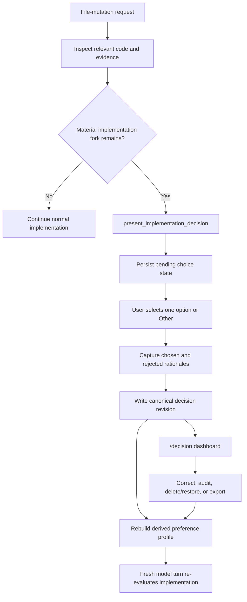

# Decision Journal

> Korean version: [Decision Journal (한국어)](./decision-journal_kor.md)

KernForge's Decision Journal records the reasoning behind material implementation choices, keeps that evidence in one private per-user location across repositories, and derives conservative preference rules from repeated decisions. It is designed to answer questions such as:

> When solving this problem, why did this user choose this approach, and why did they reject the alternatives?

The journal captures evidence. It does **not** silently turn a single answer into a permanent coding rule, and the current KernForge agent does not automatically apply the derived rules to future implementation choices.

## Concepts

| Concept | Meaning |
| --- | --- |
| Decision checkpoint | A model-proposed, runtime-validated pause before the first edit when two to four materially different approaches remain viable. |
| Pending decision | The resumable choice or rationale state stored with the KernForge session until the user finishes it. |
| Decision record | The canonical, revisioned JSON record containing the fork, explicit choice, chosen rationale, rejected rationales, context, and provenance. |
| Preference profile | A rebuildable derived file containing only patterns with enough repeated, explicit user evidence. |
| Decision dashboard | The local `/decision` web UI for browsing, correcting, auditing, deleting/restoring, rebuilding, and exporting records. |

## System overview



The journal lives outside repositories, so one dashboard can aggregate choices from many projects without adding journal files to each Git worktree.

## When a checkpoint should appear

For requests that allow file mutation, KernForge tells the model to inspect the relevant code before proposing a decision checkpoint. The internal `present_implementation_decision` tool is appropriate only when all of these conditions hold:

1. The implementation has not started.
2. Two to four approaches remain genuinely viable.
3. The approaches have meaningful differences in correctness, compatibility, security, performance, maintainability, dependency cost, migration risk, or operational behavior.
4. The model can explain the objective tradeoffs and mark exactly one advisory recommendation.
5. The model reports a material-fork confidence from `0.65` through `1.0`.

The runtime rejects malformed proposals: fewer than two or more than four options, duplicate or empty option IDs/labels, empty descriptions, multiple recommendations, no recommendation on the capture path, or a non-finite/out-of-range confidence.

A checkpoint should **not** be used for:

- syntax, formatting, naming, or another low-impact style choice;
- a choice already fixed by the user's request;
- a situation with only one technically viable or safe implementation;
- a speculative choice raised before the relevant code has been inspected;
- a request that does not authorize implementation changes.

The model proposes the checkpoint; the runtime validates its shape and enforces the pause. The confidence value is not an independent statistical classifier score.

## Capture flow

### 1. Proposal and idempotency check

KernForge validates the proposal, fills missing capture fingerprints, computes a deterministic decision ID, and checks whether that ID already exists. If it exists, the capture tool treats the ID as the canonical idempotency key and returns the stored record without comparing a newly proposed body. At the lower store API boundary, a direct repeated `Put` with equivalent content returns the existing record, while different content under the same ID is a conflict.

### 2. Explicit approach selection

The prompt displays two to four listed approaches with their descriptions, any supplied pros/cons, and the model's recommendation. The recommendation is advisory:

- the user must explicitly select exactly one listed option or `Other`;
- pressing Enter does not accept the recommendation;
- `Other` accepts a custom answer up to 1,024 bytes;
- custom text that case-insensitively matches a listed label is canonicalized to that listed option.

The choice-stage pending state is written to the session before the question is shown.

### 3. Rationale collection

After the selection, KernForge requires:

1. one reason for choosing the selected approach; and
2. one reason for rejecting every non-selected listed approach.

If `Other` was selected, every listed approach needs a rejection reason. Each rationale is required and limited to 4,096 bytes. This produces the intended statement:

> `<problem>` 문제를 해결할 때 이 사용자는 `<selected approach>` 결정을 `<selected reason>` 때문에 했다. 다른 방안은 `<alternative>: <rejection reason>` 때문에 선택하지 않았다.

### 4. Canonical write and continuation

KernForge writes revision 1 to the canonical journal before implementation continues, clears the pending state, and tries to rebuild the preference profile. The journal write remains successful if the derived profile rebuild fails; the tool reports a warning and the dashboard marks the profile stale or failed.

When a decision tool call appears in a model response, every other tool call in that same response is marked `NOT_EXECUTED`, regardless of its position. KernForge does not queue those calls automatically. A fresh model turn must re-evaluate the user's choice and decide what to run.

## Pending, cancellation, and resume behavior

Only one decision can be pending in a session. While it is pending:

- `present_implementation_decision` may resume that decision;
- tools explicitly declared read-only remain available;
- every other registered tool fails closed, including unknown custom or MCP tools;
- a different proposal cannot replace or bypass the pending proposal;
- `/clear` does not remove the pending decision.

The stored pending proposal is canonical. On resume, the model calls the tool with only:

```json
{"decision_id":"<pending-decision-id>"}
```

KernForge revalidates the saved proposal instead of trusting a reconstructed copy.

Cancellation preserves the checkpoint; it does not abandon it:

| Cancellation point | Persisted stage | What happens on resume |
| --- | --- | --- |
| Approach choice | `choice` | The approach question is shown again. |
| Selected rationale | `rationale` | The selection remains; all rationale questions restart. |
| Any alternative rationale | `rationale` | The selection remains; the selected and rejected rationales all restart. |

Partial rationale text is deliberately not stored in pending session state. There is currently no separate discard/abandon command, so the pending checkpoint must be completed before mutations can continue.

In a non-interactive run, KernForge persists the pending decision and stops instead of guessing an answer. Resume the same session interactively. The dashboard itself also requires a long-lived interactive process; `kernforge -command /decision` is rejected because the process would exit and close the server immediately.

## Autonomous goal integration

Decision checkpoints also apply inside autonomous goals. KernForge checks for a pending decision after implementation, review, review repair, and semantic repair phases. If one appears:

- the current goal attempt is recorded as paused;
- later review or verification work for that attempt stops;
- the paused attempt does not consume an iteration;
- resuming reuses the same iteration index, even with `max_iterations=1`;
- the existing iteration checkpoint is reused, so the rollback baseline does not advance past work performed before the pause.

After completing the decision, run the goal again to continue it.

## Decision record model

The canonical record uses schema version 1. Its fields are grouped as follows:

| Group | Important fields | Purpose |
| --- | --- | --- |
| Lifecycle | `schema_version`, `id`, `revision`, `created_at`, `updated_at`, `status`, `deleted_at` | Versioning and soft-delete state. Status is `completed`, `corrected`, or `deleted`. |
| Runtime identity | `session_id`, `feature_id`, `goal_id`, `edit_loop_id` | Connects the decision to the runtime flow that produced it. |
| Project identity | `project_id`, `project_alias`, `workspace`, `workspace_hash` | Groups records across the local machine while retaining an operator-friendly label. |
| Classification | `domains`, `languages`, `decision_kind`, `risk_level`, `tags`, `detector_confidence` | Provides matching and filtering context. |
| Problem and evidence | `problem`, `task_fingerprint`, `evidence_fingerprint`, `evidence_refs` | Describes the fork and makes repeated capture idempotent when possible. |
| Options | `options`, `recommended_option_id` | Stores each option's label, description, pros, cons, order, source, and recommendation marker. |
| User judgment | `selected_option_id` or `custom_selection`, `selection_reason_raw`, `rejected_reasons` | Stores the explicit selection and why other choices were rejected. |
| Summary | `summary_sentence` | Stores the compact Korean decision statement generated from the rationales. |
| Audit | `provenance`, `redaction` | Identifies model/user/runtime origins and whether secret-like text was replaced. |

Representative excerpt, with private runtime metadata omitted:

```json
{
  "schema_version": 1,
  "id": "decision-44c0f9b71bf8194908f3a91c41e937ee",
  "revision": 1,
  "project_id": "project-96a135c525cf3178",
  "domains": ["storage", "dashboard"],
  "languages": ["go", "javascript"],
  "decision_kind": "persistence-layout",
  "risk_level": "medium",
  "problem": "Implementation decisions scattered across repositories",
  "options": [
    {
      "id": "per-repository",
      "label": "Per-repository records",
      "description": "Keep project decisions beside project source",
      "recommended": false,
      "order": 1,
      "source": "model"
    },
    {
      "id": "global-journal",
      "label": "Per-user global journal",
      "description": "Aggregate records outside repositories and retain project identity",
      "recommended": true,
      "order": 2,
      "source": "model"
    }
  ],
  "recommended_option_id": "global-journal",
  "selected_option_id": "global-journal",
  "selection_reason_raw": "multi-project aggregation without committing personal data",
  "rejected_reasons": [
    {
      "option_id": "per-repository",
      "reason": "fragmented preference evidence and accidental commit risk",
      "source": "user"
    }
  ],
  "summary_sentence": "Implementation decisions scattered across repositories 문제를 해결할 때 이 사용자는 Per-user global journal 결정을 multi-project aggregation without committing personal data 때문에 했다. 다른 방안은 Per-repository records: fragmented preference evidence and accidental commit risk 때문에 선택하지 않았다.",
  "detector_confidence": 0.91,
  "status": "completed",
  "provenance": {
    "options": "model",
    "selection": "user",
    "rationale": "user",
    "summary": "runtime"
  }
}
```

The capture path records `options=model`, `selection=user`, `rationale=user`, and `summary=runtime`. Preference derivation requires explicit user provenance for both selection and rationale. Imported or manually repaired data can therefore remain auditable without automatically becoming preference evidence.

Important size limits include a 1 MiB record, 4 KiB problem/selection/rejection text, 1 KiB custom selection, 32 KiB workspace, 24 KiB generated summary, 256-byte option label, 2 KiB option description, and 2 KiB evidence reference. Stored JSON rejects unknown fields and trailing data.

## Project and decision identity

### Project identity

Capture prefers the workspace `BaseRoot` and falls back to the active `Root`. KernForge then:

1. resolves an absolute path;
2. resolves symlinks when possible;
3. cleans the path and converts separators to `/`;
4. lowercases the canonical path on Windows;
5. hashes it with SHA-256.

`workspace_hash` stores the full hexadecimal digest. `project_id` stores `project-` plus the first 16 hexadecimal characters. The default alias is the canonical path's basename.

Using `BaseRoot` keeps KernForge temporary worktrees grouped with their source repository. A moved repository or a clone at another absolute path becomes a different project. This is path identity, not repository-content identity and not anonymization: a known candidate path can be hashed and compared.

`project_alias` is stored per decision, not as a global project object. The dashboard's project selector displays the alias from the most recently updated record for that project. Editing an alias changes only that record.

### Decision identity

The capture tool always fills both fingerprints before computing the decision ID. A missing task fingerprint becomes a stable hash of `session_id + problem`; a missing evidence fingerprint becomes a hash of sorted option IDs/labels and sorted evidence references. The ID is then derived from the project ID, both fingerprints, problem, and sorted option ID/label pairs.

Retries with the same generated inputs in one session therefore converge on one ID. Because the automatically generated task fingerprint includes `session_id`, an equivalent proposal from a different session is not guaranteed to converge unless the caller supplies an explicit stable task fingerprint. The timestamp-plus-random fallback exists only at the lower store API boundary for records inserted directly with both fingerprints missing. Stable IDs make retries idempotent; they do not merge semantically different choices that happen to use a generic option ID.

## Storage, revisions, and concurrency

The canonical files live outside repositories:

```text
~/.kernforge/decision-rationales/
  records/
    <decision-id>.json
    <decision-id>.json.lock
  history/
    <decision-id>/
      revision-000001.json
      revision-000002.json
  profiles/
    profile.json
    profile.json.lock
```

The lock files are persistent synchronization files and may remain when no process owns the lock.

### Revision contract

- A new record starts at revision 1.
- Every edit supplies `expected_revision`; a mismatch returns a conflict instead of overwriting newer data.
- Before writing revision N+1, KernForge preserves revision N in the history directory and atomically replaces the canonical current file.
- A no-op dashboard patch does not create a revision.
- Editing or restoring produces status `corrected`.
- Deleting produces a new `deleted` revision with `deleted_at`; it does not remove the canonical record or history.
- History reads combine prior files with the canonical current record and require continuous revisions from 1 through the current revision.
- There is no dashboard action to hard-delete or revert directly to an older revision.

Each record is an independent JSON file, avoiding one global read-modify-write bottleneck. Writes use a process-local mutex, a cross-process OS file lock, revision compare-and-swap, and a same-directory temporary file followed by atomic replacement. The profile has equivalent locking. History preservation and canonical replacement are ordered, but they are not one multi-file filesystem transaction.

## Local dashboard

### Start and lifetime

Run the following command in an interactive KernForge session:

```text
/decision
```

The command has no arguments or subcommands. The first invocation starts an ephemeral TCP4 listener on `127.0.0.1`; later invocations reuse the process-owned server, update the current workspace, and issue a new one-time launch token. The dashboard stops when that KernForge process exits.

KernForge opens the default browser when possible. If the browser opener fails, the terminal prints the authenticated launch URL. Treat an unconsumed launch URL as sensitive and open only the most recently issued one.

### Browse and inspect

The dashboard provides:

- current-project scope by default, plus explicit all-projects or selected-project scope;
- project, domain, decision-kind, and text filters;
- an `Include deleted` audit/restore toggle;
- a decision-fork view showing recommended, selected, and rejected branches;
- selected and rejected rationales, evidence context, provenance, redaction state, and lifecycle metadata;
- healthy records plus an issue banner when another current record cannot be read.

The UI loads 100 records per page; the API accepts page sizes from 1 through 500. Pagination snapshots freeze the matching ID membership and order, not every record body. New captures cannot be inserted into the middle of that snapshot, but an existing ID is read at its latest revision on a later page.

Snapshot state has a 15-minute idle lifetime and a bounded cache: at most four snapshots, 100,000 record IDs, and approximately 64 MiB in aggregate. An expired/evicted cursor or a record removed from a snapshot causes the UI to reload the current scope from its first page.

### Correct, delete, and restore

The dashboard can edit:

- listed or custom selection;
- selected rationale and every rejected rationale;
- tags and domains;
- decision kind and risk level;
- the per-record project alias.

It cannot edit the original problem, option definitions, recommendation, languages, evidence references, or detector confidence. Selection or rationale changes regenerate the runtime summary and set user provenance on the edited judgment. Metadata-only changes preserve an existing curated summary. Optimistic revision checks detect another dashboard or process changing the same record; reload and retry after a conflict.

Soft delete keeps the full audit trail and excludes the decision from default browsing, export, and profile derivation. Enable `Include deleted` to inspect or restore it.

### Preference rules

The profile panel shows derived rules and their evidence. The dashboard may change only operator overrides:

- `enabled` — whether a future consumer should consider the rule;
- `pinned` — operator emphasis metadata;
- `user_note` — a private, redacted annotation.

Pinning does not bypass evidence thresholds, force promotion, or automatically apply a rule. Overrides survive rebuilds, including temporary demotion and later re-promotion of the same stable rule ID.

Decision mutations return as soon as the canonical revision is committed. Profile rebuild requests are coalesced in a cancellable background worker, and the UI shows dirty, rebuilding, or error state until it finishes. `Rebuild profile` performs an explicit synchronous rebuild.

### Export

The dashboard exports the current filtered canonical records as a JSON array named `kernforge-decisions-YYYYMMDD-HHMMSS.json`. It includes neither revision history nor `profile.json`.

The default privacy-reduced export removes:

- `session_id`, `feature_id`, `goal_id`, and `edit_loop_id`;
- the absolute `workspace` and per-record `project_alias`;
- `evidence_refs`.

It still contains rationales, timestamps, decision IDs, `project_id`, `workspace_hash`, task/evidence fingerprints, and redaction metadata. It is therefore **not anonymous**. `Include private local metadata` retains the removed fields, but it cannot restore text that was already redacted at write time.

Export includes current records only and fails closed if any current record in the store is unreadable. Review the output before sharing either mode.

## Preference profile derivation

`profiles/profile.json` is a rebuildable cache; active journal records are the source of truth. A decision contributes only when all of the following hold:

- it is not deleted;
- `decision_kind` and the selected rationale are non-empty;
- selection provenance is `user`;
- rationale provenance is `user`;
- `detector_confidence >= 0.80`.

The `0.80` promotion eligibility threshold is intentionally stricter than the `0.65` capture threshold.

### Contexts and signatures

Each eligible record contributes to:

1. its project context, when `project_id` exists;
2. each normalized domain context;
3. the global context.

Rules are grouped by scope, scope key, and lowercased `decision_kind`. A listed preference signature combines the lowercased option ID with a hash of its normalized label. A custom choice uses a hash of its normalized custom label. This prevents unrelated projects from merging choices that reuse an ID such as `option-a` for different meanings.

### Promotion thresholds

| Scope | Minimum supporting decisions | Project diversity |
| --- | ---: | ---: |
| Project | 2 | Same project scope |
| Domain | 3 | At least 2 projects |
| Global | 5 | At least 3 projects |

Every different preference signature in the same group is contradictory evidence. When contradictions exist, support must exceed the contradiction count and satisfy:

```text
support / (support + contradictions) >= 2/3
```

Rule confidence is deterministic:

```text
scope base
+ 0.07 * supporting decisions
+ 0.04 * supporting projects
- 0.08 * contradictions
```

The scope base is `0.45` for project, `0.55` for domain, and `0.60` for global; the result is clamped to `0.10..0.95`. It is not an average of the records' detector confidence.

The profile stores support IDs, contradiction IDs, supporting project IDs, operator overrides, a profile revision, and a source-journal hash. The source hash covers the full content of every active record, so even metadata edits can mark the profile stale. `record_count` counts active records read during rebuild, not only eligible evidence.

## Privacy and local security boundary

Decision data is personal reasoning data and should be treated as private.

### Filesystem protections

- Windows applies a protected DACL granting the current token user access to decision, history, and profile directories.
- POSIX systems use directory mode `0700` and file/lock mode `0600`.
- Reads and writes reject symbolic-link traversal; Windows also rejects reparse points.
- Files are rechecked as regular files after opening.
- Records are stored outside the repository and are not committed or synchronized automatically.

These controls are access restrictions, **not encryption at rest**.

### Secret redaction

Before persistence, KernForge applies pattern-based redaction to free text such as the problem, workspace/alias, options, rationales, summary, domains, languages, tags, evidence references, preference labels, and profile notes. Identifier-like fields containing secret-looking values are rejected or replaced with stable redacted identifiers at the pending-session boundary.

Pending state, decision tool arguments/results, runtime interventions, related conversation events, and both the primary session file and its `.bak` are sanitized before persistence. Redaction metadata records that replacement occurred. The replacement is irreversible; private export does not recover the original value.

Redaction is best-effort pattern detection, not a secret vault. Never intentionally enter API keys, access tokens, private keys, passwords, signed URLs, or other secrets in a decision answer.

### Dashboard request protections

The dashboard:

- binds only to an ephemeral `127.0.0.1` port;
- exchanges a one-time URL-fragment token before removing it from the address bar;
- requires a scoped `HttpOnly`, `SameSite=Strict` cookie plus `X-KernForge-Session` on API requests;
- additionally requires exact `Origin` and `X-CSRF-Token` proof for mutations;
- rejects Host mismatches and cross-site fetches;
- sends restrictive CSP, no-store, no-referrer, no-sniff, frame-deny, and permissions-policy headers.

This protects the local browser surface, but any process running as the same user should still be considered inside the local trust boundary.

## Failure and recovery guide

| Symptom | Meaning and recovery |
| --- | --- |
| A decision remains pending after cancel or `/clear` | This is expected. Resume the same session and complete the saved decision; there is no discard command. |
| A non-interactive run stops at a checkpoint | Resume that session interactively. KernForge will not infer the choice. |
| The browser did not open | Use the authenticated URL printed by the active session. Run `/decision` again if it was consumed or expired. |
| An old dashboard returns 401 or no longer loads | The token was replaced/consumed or its KernForge process ended. Run `/decision` in the active interactive process. |
| Edit or rule update returns a revision conflict | Another page/process committed first. Reload the latest record/profile and retry the edit. |
| Load more restarts the list | The bounded cursor expired, was evicted, or no longer resolves. The UI reloads the same scope safely. |
| Healthy records appear with a read-issue banner | At least one current JSON file is damaged. Back it up, then repair or quarantine the named file. Export and profile rebuild remain fail-closed until every current record is readable. |
| History fails because a revision is missing or conflicts | Restore the correct revision file; deleting another history entry can make continuity worse. History operations fail closed. |
| The profile is missing or stale | Rebuild it from the canonical journal in the dashboard. Journal records remain authoritative. |
| `profile.json` is corrupt and rebuild fails | Back up and repair or remove the corrupt profile file, then rebuild. KernForge does not silently overwrite an unreadable profile. |
| Automatic profile rebuild fails after an edit | The decision revision is still committed. Read the dirty/error banner, correct the storage issue, and retry the manual rebuild. |
| A moved or separately cloned repository appears as a new project | Project identity is based on normalized absolute base-workspace path. This is expected. |

Avoid hand-editing canonical JSON when the dashboard can perform the correction. Stored records enforce schema, ID, revision, lifecycle, size, and history-continuity contracts.

## Current boundary and future consumers

Today, KernForge captures, audits, exports, and derives preference evidence. It does not:

- create decisions manually from the dashboard;
- automatically synchronize the journal between machines;
- encrypt journal contents itself;
- automatically force future implementation choices from `profile.json`;
- let `pinned` bypass evidence requirements;
- provide `/decision` subcommands or a pending-decision discard command.

A future preference-aware tool should read enabled rules as evidence, not commands. A conservative resolution order is project, then relevant domain, then global; it should show the matched criterion, confidence, supporting and contradictory decisions, and still ask when the current tradeoff materially differs. Keeping capture and application separate prevents a small or stale evidence set from becoming a self-reinforcing policy.

## Implementation references

- Capture state machine and project identity: [`implementation_decision_tool.go`](../cmd/kernforge/implementation_decision_tool.go)
- Canonical store, revisions, export, and redaction: [`implementation_decision_store.go`](../cmd/kernforge/implementation_decision_store.go)
- Derived profile and promotion rules: [`implementation_preference_profile.go`](../cmd/kernforge/implementation_preference_profile.go)
- Dashboard server and local security boundary: [`decision_dashboard_server.go`](../cmd/kernforge/decision_dashboard_server.go)
- Dashboard client: [`decision_dashboard_assets/app.js`](../cmd/kernforge/decision_dashboard_assets/app.js)
- Slash command entry point: [`commands_decision.go`](../cmd/kernforge/commands_decision.go)
