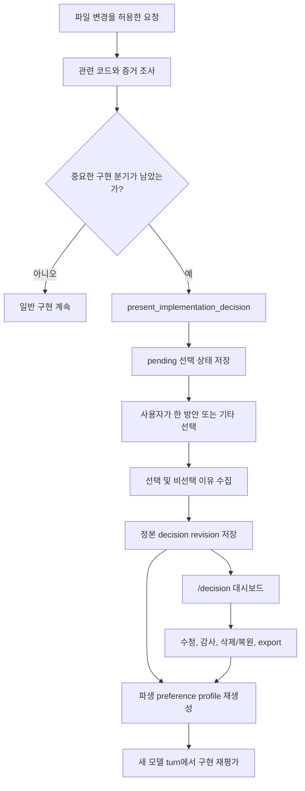

# Decision Journal

> 영문 문서: [Decision Journal](./decision-journal.md)

KernForge의 Decision Journal은 구현 과정에서 발생한 중요한 선택과 그 판단 근거를 기록하고, 여러 저장소에서 쌓인 정보를 사용자별 전역 저장소에 모으며, 반복된 결정에서 보수적으로 취향 규칙을 도출하는 기능이다. 이 기능이 남기려는 핵심 정보는 다음과 같다.

> OO 문제를 해결할 때 이 사용자는 왜 OO 방안을 선택했고, 다른 OO 방안은 왜 선택하지 않았는가?

Decision Journal은 판단의 **증거**를 수집한다. 한 번의 답변을 영구 규칙으로 만들지 않으며, 현재 KernForge 에이전트는 도출된 규칙을 이후 구현 선택에 자동 적용하지 않는다.

## 핵심 개념

| 개념 | 의미 |
| --- | --- |
| Decision checkpoint | 실제 수정 전에 2~4개의 의미 있는 구현 방안이 남았을 때 모델이 제안하고 런타임이 검증하는 일시 중지 지점이다. |
| Pending decision | 사용자가 답변을 완료할 때까지 KernForge 세션에 저장되는 선택 또는 근거 입력 상태다. |
| Decision record | 문제, 선택지, 명시적 선택, 선택 이유, 비선택 이유, 문맥, 출처를 담는 정본 revision JSON이다. |
| Preference profile | 충분히 반복된 명시적 사용자 판단만 규칙으로 승격한 재생성 가능한 파생 파일이다. |
| Decision dashboard | 기록 조회·수정·감사·삭제/복원·프로필 재생성·export를 제공하는 `/decision` 로컬 웹 UI다. |

## 전체 구조



저널은 개별 저장소 바깥에 있으므로 Git worktree마다 개인 판단 데이터를 추가하지 않고 여러 프로젝트의 결정을 한 대시보드에서 모을 수 있다.

## 언제 checkpoint를 사용해야 하는가

파일 변경이 허용된 요청에서 KernForge는 모델에게 관련 코드를 먼저 조사하도록 안내한다. 내부 도구 `present_implementation_decision`은 다음 조건을 모두 만족할 때만 사용해야 한다.

1. 실제 구현 수정을 시작하기 전이다.
2. 기술적으로 가능한 방안이 2~4개 남아 있다.
3. 정확성, 호환성, 보안, 성능, 유지보수성, 의존성 비용, 마이그레이션 위험, 운영 방식 중 하나 이상에서 의미 있는 차이가 있다.
4. 각 방안의 객관적인 장단점을 설명할 수 있고, 모델 권장안을 정확히 하나 표시할 수 있다.
5. 모델이 이 분기가 중요하다고 판단한 신뢰도 `detector_confidence`가 `0.65` 이상 `1.0` 이하이다.

런타임은 선택지가 2개 미만 또는 4개 초과인 제안, 비어 있거나 중복된 option ID/label, 비어 있는 설명, 여러 권장안, capture 경로에서 권장안이 없는 제안, 유한하지 않거나 범위를 벗어난 신뢰도를 거부한다.

다음 경우에는 checkpoint를 사용하지 않는다.

- 문법, 포맷, 이름처럼 영향이 작은 스타일 선택
- 사용자가 요청에서 이미 결정한 사항
- 안전하고 유효한 구현이 사실상 하나뿐인 경우
- 관련 코드를 조사하기 전에 만든 추측성 선택지
- 구현 변경 권한이 없는 요청

모델이 checkpoint를 제안하고 런타임이 형식과 중지를 강제한다. `detector_confidence`는 독립적인 통계 분류기가 산출한 값이 아니라 모델이 제출한 판단값이다.

## 결정 수집 흐름

### 1. 제안 검증과 중복 방지

KernForge는 제안을 검증하고 누락된 capture fingerprint를 채운 뒤 결정적인 decision ID를 계산해 기존 기록을 확인한다. ID가 이미 있으면 capture tool은 그 ID를 정본 idempotency key로 취급하고 새 proposal body를 비교하지 않은 채 저장된 record를 반환한다. 더 낮은 store API 경계에서 직접 `Put`할 때는 동등한 내용을 다시 쓰면 기존 record를 반환하고, 같은 ID에 다른 내용을 쓰면 conflict로 처리한다.

### 2. 명시적 방안 선택

질문에는 2~4개 방안의 설명과, 제안에 포함된 경우 장단점, 모델 권장안이 표시된다. 권장안은 참고 정보일 뿐이다.

- 사용자는 나열된 방안 하나 또는 `기타(Other)`를 명시적으로 골라야 한다.
- Enter만 눌러 권장안을 자동 선택할 수 없다.
- `기타`는 최대 1,024바이트의 주관식 답변을 받는다.
- 기타 입력이 기존 label과 대소문자 구분 없이 일치하면 해당 기존 방안으로 정규화한다.

선택 질문을 표시하기 전에 choice 단계의 pending 상태를 세션에 저장한다.

### 3. 선택 및 비선택 이유 수집

방안을 고른 뒤 KernForge는 다음 답변을 필수로 받는다.

1. 선택한 방안을 고른 이유 하나
2. 선택하지 않은 모든 기존 방안 각각의 이유 하나

`기타`를 골랐다면 나열된 방안 모두에 비선택 이유가 필요하다. 각 이유는 필수이며 최대 4,096바이트다. 완료된 기록은 다음 형태의 문장을 만든다.

> `<문제>` 문제를 해결할 때 이 사용자는 `<선택한 방안>` 결정을 `<선택 이유>` 때문에 했다. 다른 방안은 `<대안>: <비선택 이유>` 때문에 선택하지 않았다.

### 4. 정본 저장과 구현 재개

KernForge는 구현을 계속하기 전에 정본 저널에 revision 1을 기록하고 pending 상태를 제거한 뒤 preference profile 재생성을 시도한다. 파생 profile 재생성에 실패해도 이미 성공한 저널 기록은 롤백하지 않는다. 경고를 반환하고 대시보드에 stale 또는 failed 상태를 표시한다.

모델 응답에 decision tool call이 있으면 같은 응답의 다른 모든 tool call은 순서와 무관하게 `NOT_EXECUTED` 처리된다. 이 호출들은 자동 대기열에 들어가지 않는다. 새 모델 turn에서 사용자의 선택을 반영해 실행 여부와 인자를 다시 판단해야 한다.

## Pending, 취소, 재개 동작

한 세션에는 하나의 decision만 pending일 수 있다. Pending 상태에서는 다음 규칙을 적용한다.

- `present_implementation_decision`은 현재 결정을 재개할 수 있다.
- 명시적으로 read-only라고 선언한 도구만 계속 사용할 수 있다.
- 그 밖의 등록 도구는 모두 fail-closed로 차단한다. 이름을 모르는 custom/MCP 도구도 포함한다.
- 다른 제안으로 현재 pending을 교체하거나 우회할 수 없다.
- `/clear`를 실행해도 pending decision은 제거되지 않는다.

세션에 저장된 proposal이 정본이다. 재개할 때 모델은 다음 값만 전달한다.

```json
{"decision_id":"<pending-decision-id>"}
```

KernForge는 모델이 원래 제안을 다시 구성한 내용을 신뢰하지 않고, 저장된 proposal을 다시 검증한다.

취소는 checkpoint를 보존하며 폐기하지 않는다.

| 취소 지점 | 저장된 단계 | 재개 시 동작 |
| --- | --- | --- |
| 방안 선택 | `choice` | 방안 선택 질문을 다시 표시한다. |
| 선택 이유 | `rationale` | 선택은 유지하고 모든 이유 질문을 처음부터 다시 시작한다. |
| 대안 비선택 이유 | `rationale` | 선택은 유지하고 선택 이유와 모든 비선택 이유를 처음부터 다시 입력한다. |

부분적으로 입력한 rationale text는 pending 세션에 저장하지 않는다. 현재 별도의 discard/abandon 명령이 없으므로 mutation을 계속하려면 기존 checkpoint를 완료해야 한다.

비대화형 실행에서는 답변을 추측하지 않고 pending decision을 저장한 뒤 중단한다. 같은 세션을 대화형으로 재개해야 한다. 대시보드도 프로세스가 계속 살아 있어야 하므로, 실행 직후 종료되는 `kernforge -command /decision`은 거부한다.

## Autonomous goal 연동

Decision checkpoint는 autonomous goal 안에서도 적용된다. KernForge는 implementation, review, review repair, semantic repair 단계 직후 pending decision을 확인한다. Pending이 발생하면 다음처럼 동작한다.

- 현재 goal attempt를 paused로 기록한다.
- 해당 attempt의 이후 review 또는 verification을 중단한다.
- paused attempt는 iteration을 소비하지 않는다.
- `max_iterations=1`이어도 재개할 때 같은 iteration index를 사용한다.
- 기존 iteration checkpoint를 재사용하므로 pause 전에 수행한 작업 뒤로 rollback baseline이 이동하지 않는다.

결정 답변을 완료한 뒤 goal을 다시 실행하면 이어서 진행한다.

## Decision record 데이터 모델

정본 record는 schema version 1을 사용한다. 주요 필드는 다음과 같이 나뉜다.

| 그룹 | 주요 필드 | 용도 |
| --- | --- | --- |
| Lifecycle | `schema_version`, `id`, `revision`, `created_at`, `updated_at`, `status`, `deleted_at` | Version과 soft-delete 상태를 관리한다. 상태는 `completed`, `corrected`, `deleted`다. |
| Runtime identity | `session_id`, `feature_id`, `goal_id`, `edit_loop_id` | 결정을 생성한 runtime 흐름과 연결한다. |
| Project identity | `project_id`, `project_alias`, `workspace`, `workspace_hash` | 로컬 머신의 프로젝트를 묶고 사람이 읽을 label을 유지한다. |
| Classification | `domains`, `languages`, `decision_kind`, `risk_level`, `tags`, `detector_confidence` | 필터와 규칙 매칭 문맥을 제공한다. |
| Problem/evidence | `problem`, `task_fingerprint`, `evidence_fingerprint`, `evidence_refs` | 구현 분기를 설명하고 가능한 경우 중복 capture를 방지한다. |
| Options | `options`, `recommended_option_id` | 각 방안의 label, 설명, 장단점, 순서, source, recommendation을 저장한다. |
| User judgment | `selected_option_id` 또는 `custom_selection`, `selection_reason_raw`, `rejected_reasons` | 명시적 선택과 다른 방안을 배제한 이유를 저장한다. |
| Summary | `summary_sentence` | 이유에서 생성한 짧은 한국어 결정 문장을 저장한다. |
| Audit | `provenance`, `redaction` | model/user/runtime 출처와 secret-like text 치환 여부를 남긴다. |

다음은 private runtime metadata를 생략한 예시다.

```json
{
  "schema_version": 1,
  "id": "decision-44c0f9b71bf8194908f3a91c41e937ee",
  "revision": 1,
  "project_id": "project-96a135c525cf3178",
  "domains": ["storage", "dashboard"],
  "languages": ["go", "javascript"],
  "decision_kind": "persistence-layout",
  "risk_level": "medium",
  "problem": "여러 저장소에 구현 결정 정보가 흩어지는",
  "options": [
    {
      "id": "per-repository",
      "label": "각 저장소에 기록",
      "description": "프로젝트 결정 파일을 소스 코드 옆에 보관한다",
      "recommended": false,
      "order": 1,
      "source": "model"
    },
    {
      "id": "global-journal",
      "label": "사용자 전역 저널 사용",
      "description": "저장소 밖에서 기록을 모으고 프로젝트 identity를 유지한다",
      "recommended": true,
      "order": 2,
      "source": "model"
    }
  ],
  "recommended_option_id": "global-journal",
  "selected_option_id": "global-journal",
  "selection_reason_raw": "여러 프로젝트 지원과 개인 데이터의 저장소 외부 보관",
  "rejected_reasons": [
    {
      "option_id": "per-repository",
      "reason": "취향 증거가 흩어지고 개인 데이터가 실수로 커밋될 위험",
      "source": "user"
    }
  ],
  "summary_sentence": "여러 저장소에 구현 결정 정보가 흩어지는 문제를 해결할 때 이 사용자는 사용자 전역 저널 사용 결정을 여러 프로젝트 지원과 개인 데이터의 저장소 외부 보관 때문에 했다. 다른 방안은 각 저장소에 기록: 취향 증거가 흩어지고 개인 데이터가 실수로 커밋될 위험 때문에 선택하지 않았다.",
  "detector_confidence": 0.91,
  "status": "completed",
  "provenance": {
    "options": "model",
    "selection": "user",
    "rationale": "user",
    "summary": "runtime"
  }
}
```

Capture 경로는 `options=model`, `selection=user`, `rationale=user`, `summary=runtime`을 기록한다. Preference 도출은 selection과 rationale 모두 명시적인 user provenance가 있어야 한다. 따라서 import하거나 수리한 데이터는 감사 가능한 기록으로 남아도 자동으로 preference evidence가 되지 않을 수 있다.

주요 크기 제한은 record 1 MiB, problem/selection/rejection text 4 KiB, custom selection 1 KiB, workspace 32 KiB, 생성 summary 24 KiB, option label 256바이트, option description 2 KiB, evidence reference 2 KiB다. 저장 JSON은 알 수 없는 field와 trailing data를 거부한다.

## Project 및 decision identity

### Project identity

Capture는 workspace의 `BaseRoot`를 우선하고 없으면 active `Root`를 사용한다. 이후 KernForge는 다음 순서로 identity를 만든다.

1. 절대 경로로 변환한다.
2. 가능하면 symbolic link를 해석한다.
3. 경로를 정리하고 separator를 `/`로 통일한다.
4. Windows에서는 canonical path를 소문자로 바꾼다.
5. SHA-256으로 hash한다.

`workspace_hash`에는 전체 16진수 digest를 저장하고, `project_id`에는 `project-`와 앞 16자리 16진수를 저장한다. 기본 alias는 canonical path의 basename이다.

`BaseRoot`를 사용하므로 KernForge 임시 worktree는 원본 저장소와 같은 프로젝트로 묶인다. 저장소를 옮기거나 다른 절대 경로에 clone하면 다른 프로젝트가 된다. 이는 저장소 내용 identity가 아니라 path identity다. 또한 익명화가 아니므로, 후보 경로를 아는 사람은 같은 hash를 계산해 비교할 수 있다.

`project_alias`는 전역 프로젝트 객체가 아니라 decision별 field다. 대시보드 project selector에는 해당 프로젝트에서 가장 최근에 갱신된 record의 alias가 표시된다. Alias 수정도 그 record 하나에만 적용된다.

### Decision identity

Capture tool은 decision ID를 계산하기 전에 두 fingerprint를 항상 채운다. Task fingerprint가 없으면 `session_id + problem`의 stable hash를 사용하고, evidence fingerprint가 없으면 정렬된 option ID/label과 evidence reference의 hash를 사용한다. 그 뒤 project ID, 두 fingerprint, problem, 정렬된 option ID/label 쌍으로 decision ID를 만든다.

따라서 같은 세션에서 생성 입력이 같은 재시도는 하나의 ID로 수렴한다. 자동 task fingerprint에는 `session_id`가 포함되므로 다른 세션의 동등한 proposal은 caller가 명시적인 stable task fingerprint를 제공하지 않으면 같은 ID를 보장하지 않는다. Timestamp와 암호학적 난수를 쓰는 fallback은 두 fingerprint가 모두 없는 record를 낮은 store API에 직접 넣을 때만 사용한다. Stable ID는 재시도의 중복을 막기 위한 것이며, 같은 일반적인 option ID를 사용한 의미가 다른 결정을 합치지 않는다.

## 저장 구조, revision, 동시성

정본 파일은 저장소 밖의 다음 위치에 있다.

```text
~/.kernforge/decision-rationales/
  records/
    <decision-id>.json
    <decision-id>.json.lock
  history/
    <decision-id>/
      revision-000001.json
      revision-000002.json
  profiles/
    profile.json
    profile.json.lock
```

Lock file은 지속되는 동기화 파일이므로 어떤 프로세스도 lock을 소유하지 않을 때도 남아 있을 수 있다.

### Revision 계약

- 새 record는 revision 1로 시작한다.
- 모든 수정은 `expected_revision`을 보내며, 값이 다르면 최신 데이터를 덮어쓰지 않고 conflict를 반환한다.
- Revision N+1을 쓰기 전에 revision N을 history directory에 보존하고 canonical current file을 atomic replace한다.
- 대시보드의 no-op patch는 새 revision을 만들지 않는다.
- 수정과 복원은 상태 `corrected`를 만든다.
- 삭제는 `deleted_at`을 포함한 새 `deleted` revision을 만들며 canonical record와 history를 제거하지 않는다.
- History 조회는 과거 파일과 canonical current record를 합치고 revision 1부터 current까지 연속인지 검증한다.
- 대시보드에는 hard delete와 과거 revision 직접 revert 기능이 없다.

각 decision을 독립 JSON 파일로 두어 전역 단일 JSON read-modify-write 병목을 피한다. 쓰기는 process-local mutex, cross-process OS file lock, revision compare-and-swap, 같은 directory의 임시 파일과 atomic replace를 사용한다. Profile도 같은 수준의 lock을 사용한다. History 보존과 canonical replace는 순서대로 실행하지만 하나의 multi-file filesystem transaction은 아니다.

## 로컬 대시보드

### 실행과 수명

대화형 KernForge 세션에서 다음 명령을 실행한다.

```text
/decision
```

이 명령에는 인자나 subcommand가 없다. 첫 실행은 `127.0.0.1`의 임시 TCP4 port에 listener를 시작한다. 이후 실행은 같은 process-owned server를 재사용하고 현재 workspace를 갱신한 뒤 새 일회용 launch token을 발급한다. 해당 KernForge 프로세스가 종료되면 대시보드도 종료된다.

가능하면 기본 브라우저를 자동으로 연다. Browser opener가 실패하면 터미널에 인증된 launch URL을 출력한다. 아직 소비하지 않은 URL은 민감 정보로 취급하고, 가장 최근에 발급된 URL만 사용한다.

### 조회와 검사

대시보드는 다음 기능을 제공한다.

- 기본 current-project scope와 명시적인 all-project 또는 selected-project scope
- project, domain, decision kind, text 필터
- 삭제 기록 감사/복원용 `Include deleted` toggle
- recommended, selected, rejected branch를 함께 보여주는 decision-fork view
- 선택 및 비선택 이유, evidence context, provenance, redaction, lifecycle metadata
- 다른 current record를 읽지 못해도 정상 record를 표시하고 문제 banner 제공

UI는 페이지당 100개를 읽고 API는 1~500개의 page size를 허용한다. Pagination snapshot은 일치하는 ID membership과 order를 고정하지만 record body 전체를 고정하지 않는다. 새 capture가 snapshot 중간에 끼지는 않지만, 기존 ID는 이후 페이지에서 최신 revision body를 읽는다.

Snapshot은 15분 idle lifetime을 가지며 cache는 최대 4개, 총 100,000 record ID, 약 64 MiB로 제한된다. Cursor가 만료·evict되거나 snapshot의 record를 더 이상 읽을 수 없으면 UI는 현재 scope 첫 페이지부터 다시 읽는다.

### 수정, 삭제, 복원

대시보드에서 수정 가능한 field는 다음과 같다.

- 기존 또는 custom selection
- 선택 이유와 모든 비선택 이유
- tags와 domains
- decision kind와 risk level
- decision별 project alias

원래 problem, option 정의, recommendation, languages, evidence references, detector confidence는 수정할 수 없다. Selection 또는 rationale을 바꾸면 runtime summary를 다시 만들고 수정한 judgment에 user provenance를 설정한다. Metadata만 수정하면 기존 curated summary를 유지한다. 다른 대시보드나 프로세스가 같은 record를 먼저 수정하면 optimistic revision check가 conflict를 감지하므로 최신 record를 다시 읽고 재시도한다.

Soft delete는 전체 감사 기록을 유지하면서 기본 목록, export, profile 도출에서 제외한다. `Include deleted`를 켜면 조회하거나 복원할 수 있다.

### Preference rule

Profile panel은 도출된 rule과 evidence를 표시한다. 대시보드가 바꿀 수 있는 것은 operator override뿐이다.

- `enabled`: 미래 consumer가 rule을 고려할지 나타낸다.
- `pinned`: 운영자가 중요하게 표시한 metadata다.
- `user_note`: redaction이 적용되는 private annotation이다.

Pin은 evidence threshold를 우회하거나 rule을 강제 승격하거나 자동 적용하지 않는다. Override는 rebuild 후에도 유지되며, 동일 stable rule ID가 일시적으로 사라졌다 다시 승격되어도 복원된다.

Decision mutation은 canonical revision commit이 끝나면 바로 응답한다. Profile rebuild request는 취소 가능한 background worker가 합쳐서 처리하며, UI는 완료 전까지 dirty, rebuilding, error 상태를 표시한다. `Rebuild profile`은 명시적인 동기 rebuild를 실행한다.

### Export

대시보드는 현재 filter에 맞는 canonical current record를 `kernforge-decisions-YYYYMMDD-HHMMSS.json` 이름의 JSON array로 내보낸다. Revision history와 `profile.json`은 포함하지 않는다.

기본 privacy-reduced export는 다음 field를 제거한다.

- `session_id`, `feature_id`, `goal_id`, `edit_loop_id`
- 절대 경로 `workspace`와 decision별 `project_alias`
- `evidence_refs`

그러나 rationale, timestamp, decision ID, `project_id`, `workspace_hash`, task/evidence fingerprint, redaction metadata는 남는다. 따라서 기본 export도 **익명 데이터가 아니다**. `Include private local metadata`를 선택하면 제거 대상 field를 유지하지만, 저장 전에 이미 redaction된 원문은 복구할 수 없다.

Export에는 current record만 들어가며, store의 current record 중 하나라도 읽을 수 없으면 fail-closed로 전체 export를 중단한다. 어느 모드든 외부에 공유하기 전에 결과를 검토해야 한다.

## Preference profile 도출 방식

`profiles/profile.json`은 재생성 가능한 cache이며 active journal record가 source of truth다. 다음 조건을 모두 만족하는 decision만 evidence로 기여한다.

- 삭제 상태가 아니다.
- `decision_kind`와 선택 이유가 비어 있지 않다.
- Selection provenance가 `user`다.
- Rationale provenance가 `user`다.
- `detector_confidence >= 0.80`이다.

Profile 승격의 `0.80` 조건은 capture 여부를 정하는 `0.65`보다 의도적으로 엄격하다.

### Context와 preference signature

Eligible record 하나는 다음 context에 기여한다.

1. `project_id`가 있으면 해당 project context
2. 정규화된 각 domain context
3. 항상 global context

Rule은 scope, scope key, 소문자 `decision_kind`로 group을 만든다. 기존 option의 preference signature는 소문자 option ID와 정규화한 label hash를 결합한다. Custom 선택은 정규화한 custom label hash를 사용한다. 따라서 서로 다른 프로젝트에서 `option-a` 같은 ID를 다른 의미로 써도 잘못 합쳐지지 않는다.

### 승격 기준

| Scope | 최소 지지 decision | Project 다양성 |
| --- | ---: | ---: |
| Project | 2 | 같은 project scope |
| Domain | 3 | 최소 2개 project |
| Global | 5 | 최소 3개 project |

같은 group의 다른 preference signature는 모두 contradictory evidence다. 반대 evidence가 있으면 support가 contradiction보다 많아야 하며 다음 비율을 만족해야 한다.

```text
support / (support + contradictions) >= 2/3
```

Rule confidence는 다음 고정식으로 계산한다.

```text
scope base
+ 0.07 * supporting decisions
+ 0.04 * supporting projects
- 0.08 * contradictions
```

Scope base는 project `0.45`, domain `0.55`, global `0.60`이며 결과는 `0.10..0.95` 범위로 제한한다. Record의 detector confidence 평균값이 아니다.

Profile에는 support ID, contradiction ID, supporting project ID, operator override, profile revision, source-journal hash가 들어간다. Source hash는 모든 active record의 전체 내용을 반영하므로 metadata 수정만으로도 profile이 stale이 될 수 있다. `record_count`는 eligible evidence만이 아니라 rebuild가 읽은 active record 전체 수다.

## Privacy와 로컬 보안 경계

Decision data는 개인 판단 정보이므로 private data로 취급해야 한다.

### Filesystem 보호

- Windows는 decision, history, profile directory에 현재 token user만 접근할 수 있는 protected DACL을 적용한다.
- POSIX는 directory mode `0700`, file/lock mode `0600`을 사용한다.
- 읽기와 쓰기 모두 symbolic-link 경유를 거부하며 Windows에서는 reparse point도 거부한다.
- Open 이후에도 regular file인지 다시 확인한다.
- Record는 저장소 밖에 있고 자동 commit 또는 동기화되지 않는다.

이 보호는 접근 제한이며 **저장 데이터 암호화가 아니다**.

### Secret redaction

저장 전에 problem, workspace/alias, option, rationale, summary, domain, language, tag, evidence reference, preference label, profile note 같은 free text에 pattern 기반 redaction을 적용한다. Secret처럼 보이는 identifier field는 거부하거나 pending-session 경계에서 안정적인 redacted identifier로 바꾼다.

Pending state, decision tool argument/result, runtime intervention, 관련 conversation event, primary session file과 `.bak` 모두 persistence 전에 sanitize한다. Redaction metadata는 치환이 발생했음을 기록한다. 치환은 되돌릴 수 없으며 private export도 원문을 복구하지 않는다.

Redaction은 best-effort pattern detection이지 secret vault가 아니다. API key, access token, private key, password, signed URL 같은 비밀정보를 decision 답변에 의도적으로 입력하면 안 된다.

### Dashboard request 보호

대시보드는 다음 보호를 적용한다.

- 임시 `127.0.0.1` port에만 bind한다.
- 일회용 URL fragment token을 교환한 뒤 address bar에서 제거한다.
- API 요청에 scoped `HttpOnly`, `SameSite=Strict` cookie와 `X-KernForge-Session`을 요구한다.
- Mutation에는 정확한 `Origin`과 `X-CSRF-Token`을 추가로 요구한다.
- Host mismatch와 cross-site fetch를 거부한다.
- 제한적인 CSP, no-store, no-referrer, no-sniff, frame-deny, permissions-policy header를 보낸다.

이는 로컬 browser surface를 보호하지만, 같은 사용자 권한으로 실행되는 프로세스는 여전히 로컬 trust boundary 안에 있다고 보아야 한다.

## 장애와 복구

| 증상 | 의미와 복구 방법 |
| --- | --- |
| 취소 또는 `/clear` 후에도 decision이 pending이다 | 정상 동작이다. 같은 세션을 재개해 저장된 결정을 완료한다. Discard 명령은 없다. |
| 비대화형 실행이 checkpoint에서 중단된다 | 해당 세션을 대화형으로 재개한다. KernForge는 답을 추론하지 않는다. |
| 브라우저가 열리지 않는다 | Active session이 출력한 인증 URL을 사용한다. 이미 소비했거나 만료됐다면 `/decision`을 다시 실행한다. |
| 예전 대시보드가 401을 반환하거나 열리지 않는다 | Token이 교체·소비됐거나 KernForge 프로세스가 종료됐다. Active interactive process에서 `/decision`을 다시 실행한다. |
| Record 또는 rule 수정 시 revision conflict가 발생한다 | 다른 page/process가 먼저 commit했다. 최신 record/profile을 다시 읽고 수정한다. |
| Load more가 목록 처음부터 다시 시작한다 | 제한된 cursor가 만료·evict됐거나 더 이상 유효하지 않다. UI가 같은 scope를 안전하게 reload한 것이다. |
| 정상 record와 함께 read-issue banner가 보인다 | Current JSON 중 하나가 손상됐다. 표시된 파일을 백업한 뒤 수리하거나 격리한다. 모든 current record를 읽기 전까지 export와 profile rebuild는 fail-closed다. |
| Revision 누락 또는 충돌로 history 조회가 실패한다 | 정확한 revision file을 복구한다. 다른 history file을 삭제하면 연속성 문제가 더 커질 수 있다. |
| Profile이 없거나 stale이다 | 대시보드에서 canonical journal로 rebuild한다. Journal record가 정본이다. |
| `profile.json` 손상으로 rebuild가 실패한다 | 손상 profile을 백업한 뒤 수리하거나 제거하고 rebuild한다. KernForge는 읽을 수 없는 profile을 자동 덮어쓰지 않는다. |
| 수정 후 automatic profile rebuild가 실패한다 | Decision revision은 이미 commit된 상태다. Dirty/error banner를 확인하고 저장소 문제를 고친 뒤 manual rebuild한다. |
| 옮기거나 별도 clone한 저장소가 새 프로젝트로 보인다 | Project identity가 정규화된 절대 base-workspace path 기반이므로 정상 동작이다. |

대시보드가 처리할 수 있는 수정은 canonical JSON을 직접 편집하지 않는 편이 안전하다. Stored record는 schema, ID, revision, lifecycle, 크기, history 연속성을 엄격히 검증한다.

## 현재 경계와 미래 consumer

현재 KernForge는 preference evidence를 수집·감사·export하고 profile로 도출하지만 다음 기능은 제공하지 않는다.

- 대시보드에서 decision을 수동 생성
- 머신 간 journal 자동 동기화
- journal 자체 암호화
- `profile.json`에 따라 이후 구현 방안을 자동 강제
- `pinned`로 evidence 조건 우회
- `/decision` subcommand 또는 pending decision discard command

미래의 preference-aware tool은 enabled rule을 명령이 아니라 evidence로 읽는 것이 안전하다. Project, 관련 domain, global 순으로 더 구체적인 rule을 먼저 보고, criterion, confidence, 지지·반대 decision을 사용자에게 보여주며 현재 tradeoff가 다르면 다시 물어야 한다. Capture와 적용을 분리하면 작거나 오래된 evidence set이 자기강화 정책으로 굳는 것을 막을 수 있다.

## 구현 파일

- Capture state machine과 project identity: [`implementation_decision_tool.go`](../cmd/kernforge/implementation_decision_tool.go)
- Canonical store, revision, export, redaction: [`implementation_decision_store.go`](../cmd/kernforge/implementation_decision_store.go)
- Derived profile과 승격 규칙: [`implementation_preference_profile.go`](../cmd/kernforge/implementation_preference_profile.go)
- Dashboard server와 로컬 보안 경계: [`decision_dashboard_server.go`](../cmd/kernforge/decision_dashboard_server.go)
- Dashboard client: [`decision_dashboard_assets/app.js`](../cmd/kernforge/decision_dashboard_assets/app.js)
- Slash command 진입점: [`commands_decision.go`](../cmd/kernforge/commands_decision.go)
